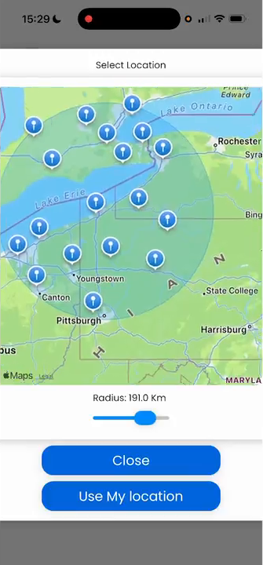
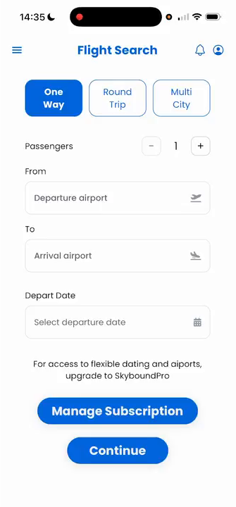
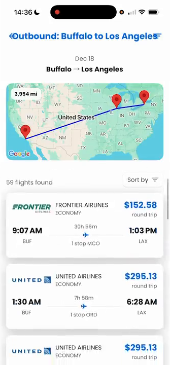
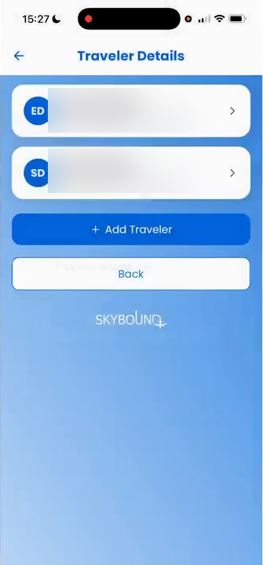
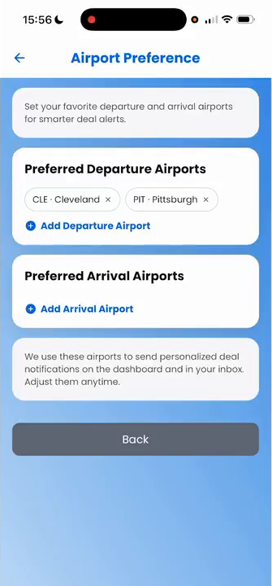
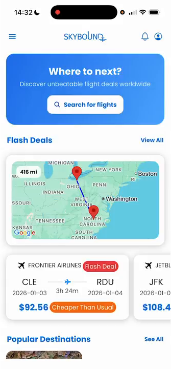

# Skybound ✈️

**A mobile flight-search and booking prototype that helps travelers compare flights from multiple nearby airports.**

Built as a collaborative software engineering project using **React Native, TypeScript, Firebase, and a team-developed flight-search API**. Rather than requiring travelers to search one departure airport at a time, Skybound lets them explore airports within a selected radius and compare available flight options.

**[▶ Watch the 95-second feature demo](docs/screenshots/Skybound_portfolio_highlights.mp4)** · **[Browse project screenshots](docs/screenshots/)**

> **Portfolio / academic project (2025).** Screenshots and the video were captured from the final project demonstration. Skybound is not a currently maintained commercial booking service; backend availability and external API access are not guaranteed. The booking screens demonstrate a prototype workflow, not live ticket purchases.

## The feature that makes Skybound different

### Radius-based airport discovery

Search around a location and select a radius to discover alternative departure airports. The resulting airport options can be used to explore more flight possibilities than a single-airport search.

  

## Feature walkthrough

| Search for flights | Compare results |
|:--:|:--:|
|  |  |
| **Manage traveler profiles** | **Set airport preferences** |
|  |  |

Other features in the project include a dashboard, flight details and summaries, flexible airport and date options, account management, and a multi-step booking flow.

View the dashboard screenshot

For a faster overview, **[watch the short highlight video](docs/screenshots/Skybound_portfolio_highlights.mp4)**. It was condensed from the final project presentation. Traveler information shown in the portfolio screenshot has been obscured.

## Technology and architecture

| Layer | Technologies and responsibilities |
| --- | --- |
| Mobile client | React Native, TypeScript, Expo, reusable UI components, client-side API integration |
| Identity and user data | Firebase Authentication, **Cloud Firestore** user and traveler records |
| Flight API | Team-developed Node.js / Express API that queries the Amadeus flight service |
| Hosting and tooling | Oracle Cloud-hosted backend, Docker configuration, Git / GitHub |

\`\`\`mermaid
flowchart LR
    UI["React Native / TypeScript app"]
    AUTH["Firebase Authentication"]
    DB["Cloud Firestore"]
    API["Team-developed Express API Oracle Cloud hosting"]
    FLIGHTS["Amadeus flight service"]
    UI -->|"Sign-in"| AUTH
    UI -->|"User and traveler CRUD"| DB
    UI -->|"Authenticated flight searches"| API
    API -->|"Flight queries"| FLIGHTS
\`\`\`

The mobile app interacts with Firebase for user data and sends authenticated requests to the team's backend, which integrates the third-party flight API. These are separate responsibilities within the overall team project.

## My contributions

This was a **team project**. My own work included:

- Developing reusable React Native / TypeScript interface components and client-side application functionality.
- Implementing **Cloud Firestore create, read, update, and delete (CRUD)** operations for user and traveler information.
- Connecting mobile client functionality to the team's **Oracle Cloud-hosted API**, including authenticated client-side requests and response handling.
- Collaborating on requirements, application workflows, and accessibility-conscious UI design.

**Team-owned components:** Other team members implemented the Express backend, the Amadeus service integration, and the Docker/deployment infrastructure. They are included here to explain the full architecture, **not** as individual implementation claims.

Relevant code to explore:
- [Firebase user and traveler CRUD](src/firestoreFunctions.ts)
- [Client-to-backend API request helper](src/api/SkyboundUtils.ts)
- [Mobile application screens](src/screens/)
- [Backend API (team implementation)](api/)

## Development setup (archival)

This repository preserves the source and setup used for the original project. **The feature demo above is the recommended way to preview Skybound.** A fully working local installation requires valid Firebase and flight-service credentials, and may require updating configuration or external endpoints.

### Mobile client

Prerequisites: Git, Node.js/npm, and Expo-compatible tooling.

\`\`\`bash
git clone https://github.com/ejd6617/Skybound.git
cd Skybound
npm install
npm start
\`\`\`

The Expo development server displays instructions / a QR code for opening the app on a compatible device. The client is configured to talk to an external API; starting Expo alone does **not** guarantee working flight searches.

### Backend (optional, original team setup)

The repository includes a [Docker Compose configuration](docker-compose.yml) for the team-developed API. To reproduce that setup, the original project expected local credential files such as:

\`\`\`text
.env.amadeus.local
.env.firebase-backend.local
.env.ngrok.local
.env.test.local
\`\`\`

A sanitized [.env.example](.env.example) documents public-facing configuration names. **Do not commit real API keys, Firebase service accounts, or other secrets.**

With appropriate credentials and compatible infrastructure, the original backend command was:

\`\`\`bash
docker compose up --build
\`\`\`

The original deployment also referenced HTTPS certificates and a hosted API address. Those resources may no longer be available; these instructions are retained for code exploration rather than as a promise of a live demo.

---

**Project:** Skybound · **Type:** collaborative software engineering / mobile application project · **Demo:** [95-second walkthrough](docs/screenshots/Skybound_portfolio_highlights.mp4)
